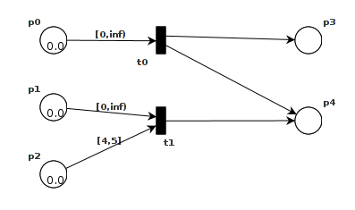
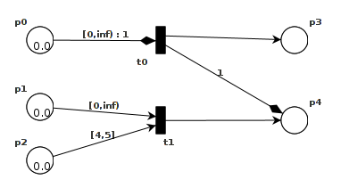
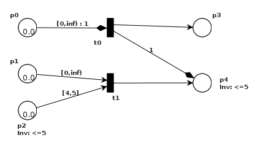
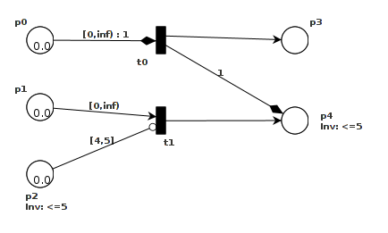

## Modelling Features

In order to provide some intuition for the Timed-Arc Petri Net (TAPN) model, we will now give an example which introduces the various features of the model in a step-by-step manner. We will start with a basic timed-arc Petri net and then gradually decorate that example with transport arcs, invariants and finally inhibitor arcs while explaining the intuition behind the change in behaviour of the net, induced by these additions. 

### Basic TAPN 
The basic timed-arc Petri net is presented in the following figure. The TAPAAL model can be found [Here](http://www.tapaal.net/fileadmin/user_manual_models/example1.tapn)

It includes two transitions t0 and t1 and five places p0, p1, p2, p3 and p4. There are tokens of age 0.0 in the places p0, p1 and p2. Initially, only t0 is `enabled` because its input place p0 contains a token of an age which satisfies the constraint on the arc from p0 to t0 (the constraint signifies that a token with an age between zero and infinity is required, i.e. a token of any age). Transition t1 requires a token of any age in p1 but also a token of an age in the interval [4,5] in p2 which is why t1 is not enabled initially.  Since t0 is enabled, we can fire it whereby we remove a token of an appropriate age from p0 and produce a token of age 0.0 in each of the places p3 and p4. However, we could also choose to do a time delay of, say, 4.5 time units, whereby all tokens in the net would grow 4.5 time units older. Since all tokens are now of age 4.5 both t0 and t1 are enabled since both would have tokens of appropriate ages in all their input places.

### Transport Arcs 
Let us now introduce transport arcs into our example net. Specifically, we will replace the normal arcs from p0 to t0 and from t0 to p4 with a transport arc from p0 through t0 to p4 as illustrated in the following figure. The TAPAAL model can be found [Here](http://www.tapaal.net/fileadmin/user_manual_models/example2.tapn).

Note that the :1 on the transport arc is there to help distinguish where each token goes in case we have more than one transport arc through the transition.

For the sake of illustration, assume that we have initially made a time delay of 2.5 time units such that all tokens are now of age 2.5. Transition t0 is still the only enabled transition in net at this point, however there is a difference when we choose to fire t0. By firing t0 we will still remove a token of appropriate age from p0 and produce a token of age 0.0 in the place p3 as before. However, due to the transport arc we will produce a token at p4 of the same age as the token we removed from p0, i.e. of age 2.5 in this case. In this way, the transport arcs allow us to preserve the age of tokens as we transport them around the net.

### Invariants 
Let us now add invariants to our example net. Specifically, we will add invariants to the places p2 and p4 that disallow tokens older than 5, as illustrated in the following figure. The TAPAAL model can be found [Here](http://www.tapaal.net/fileadmin/user_manual_models/example3.tapn).

Note that by convention, if no invariant is given for a place then this implicitly means that the invariant for this place is [0, \infty). Assume that we have done a time delay such that all tokens are of age 5.0. At this point we cannot do any further time delays because that would violate the invariant at p2. We are forced to fire either t0 or t1, both of which are enabled. Thus, invariants facilitate urgency in the model. One of the particularities of the use of invariants and transport arcs is demonstrated by the invariant of the place p4, which has implications for the transition t0 because of the transport arc from p0 through t0 to p4. Since transport arcs preserve the ages of tokens we can only fire t0 when there is a token of age smaller than or equal to 5 in p0, otherwise the token produced at p4 would violate the invariant on that place. 

### Inhibitor Arcs 
Finally, let us introduce inhibitor arcs into our example. Specifically, we will replace the arc from p2 to t1 with an inhibitor arc as illustrated in the following figure. The TAPAAL model can be found [Here](http://www.tapaal.net/fileadmin/user_manual_models/example4.tapn).

Intuitively, an inhibitor arc is the opposite of a normal arc. For instance, t1 will now be enabled whenever there is a token of any age in p1 and no token in p2. 
Thus, initially both t0 and t1 are enabled since there are tokens in p0 and p1 with appropriate ages, and there is no token in p2.
In this way, inhibitor arcs allow us to test for the absence of tokens in an input place.
