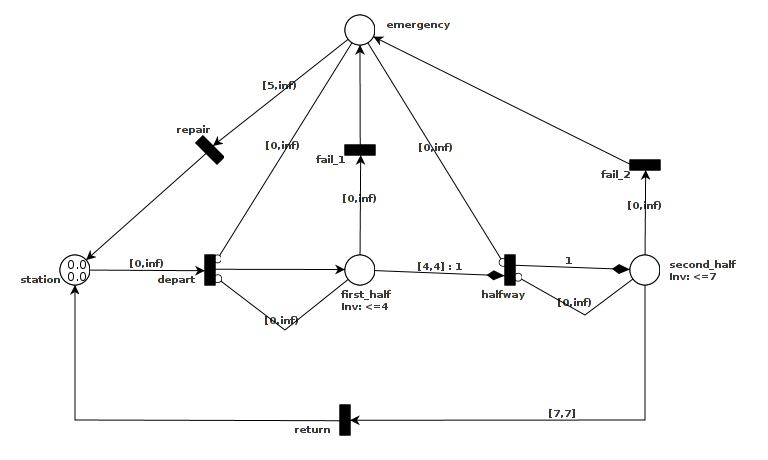

# Introduction

In this page we shall informally introduce the model used in TAPAAL, called timed-arc Petri nets with inhibitor arcs, transport arcs and invariants. To do so we shall use a model of a rollercoaster which is illustrated in the following figure. The TAPAAL model can be found [here](http://www.tapaal.net/fileadmin/user_manual_models/rollercoaster.tapn).

The model of the rollercoaster contains a number of `places` (drawn as circles), `transitions` (drawn as black squares) and `arcs` from places to transitions or transitions to places. Time intervals are associated with arcs from places to transitions. Further, the places in the model may contain `tokens`, each of which is associated with a real number signifying the age of the token. In the example, there are two tokens in the place called `station`, both with age 0.0. Invariants may be assigned to places which restrict the ages of the tokens in that place. In our example, the place `first_half` has an associated invariant of [0,4] (written inv: \leq 4). 

There are different types of arcs: normal arcs (normal arrow tip), transport arcs (diamond arrow tip) and inhibitor arcs (circle arrow tip). Intuitively, the normal arcs from places to transitions will consume tokens of appropriate ages and normal arcs from transitions to places will produce tokens of age zero. A transport arc works in a similar fashion except that any token produced will have the same age as the one consumed. Inhibitor arcs are used to test for the absence of tokens of certain ages in places.

The idea of the model is that we have two trains for the rollercoaster represented by the two tokens in `station`. The rollercoaster must ensure the safety of the passengers which means that the two trains cannot be in the same part of the track at once. Further, since a train may experience some sort of failure at any given time during its trip around the rollercoaster, the system must ensure that the other train is stopped when there is an emergency. Thus, a train can only leave the station and enter the first half of the track if there is no emergency and no other train in the first half of the track (inhibitor arcs are used to check for the absence of tokens in these places) and similarly for entering the second half of the track. 

As a concrete example, say the first train fails in the second half of the track while the second train is in the first half. In this case, the second train will be stopped before it enters the second half of the track so there can be no crash between the two.

It takes 4 time units for a train to run through the first half of the track and 3 time units to run through the second part. Thus, a full trip around the track takes 7 time units. Once the first train enters the second half of the track, the other train may leave the station. In the event that a train fails, it takes at least 5 time units to repair it and return it to the station.

Once we have a model of a system, we want to verify if certain properties are satisfied. For instance, we might want to verify if it is possible for the two trains to be in the same part of the track of the rollercoaster at once (except for the station). This property is a safety property because the proof of the property is a finite sequence of steps describing how to reach the situation where both trains are in the same part of the track. Naturally, if we can find such a sequence, we can conclude that there is an error in the mode,l as it should not be possible for the two trains to be in the same part of the track at once.
As another example of a property consider one that checks if it is possible for the two trains to run forever without any emergency. This is a liveness property because the proof is an infinite sequence of steps describing how the trains can run forever without an emergency. 
